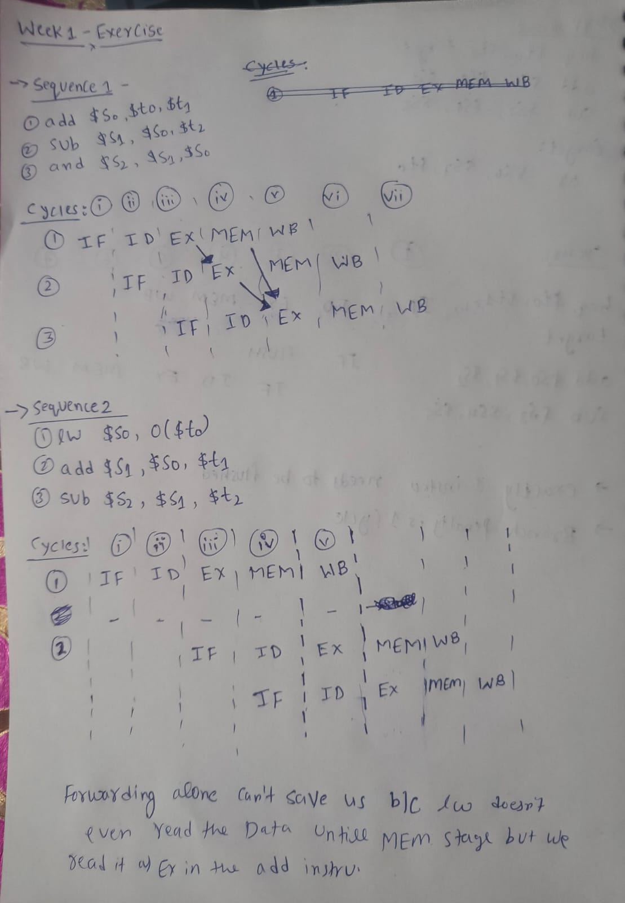
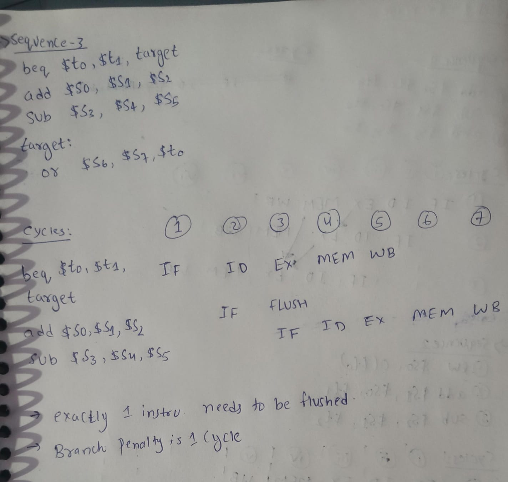

Part A
---

Part B — 6-Question Hazard Quiz
---

1\. Define structural, data, and control hazards in your own words, giving one MIPS assembly example of each.

Sol.  A structural hazard occurs when the physical hardware cannot support a combination of instructions in the same clock cycle (e.g., lw $t0, 0($t1) and sw $t2, 0($t3) if memory only has one port). 

A data hazard happens when an instruction depends on the unwritten result of a previous instruction (e.g., add $t0, $t1, $t2 followed immediately by sub $t3, $t0, $t4).

&#x20;A control hazard arises when the pipeline fetches the wrong instructions because it hasn't resolved a branch condition yet (e.g., beq $t0, $t1, target followed by add $t2, $t3, $t4). 

2\. In a 5-stage MIPS pipeline with full forwarding, what is the minimum CPI for a sequence of N independent add instructions? What is the CPI for N lw instructions where each loads into a register used by the immediately next instruction?

SOl. For a sequence of $N$ independent add instructions, the pipeline operates perfectly without stalls, resulting in a minimum CPI of 1.0 once the pipeline is full. However, for a sequence of dependent lw instructions, each load-use pair introduces a mandatory one-cycle stall even with full forwarding. Because every instruction essentially requires a stall cycle to resolve the memory dependency, the CPI for the lw sequence increases to 2.0.

3\. Explain why a single-cycle MIPS implementation can never exceed an IPC of 1, regardless of clock frequency or hardware budget. Use the Iron Law in your answer.

Sol. In a single-cycle processor, the entire instruction execution process—from fetch to writeback—must complete within one clock cycle, structurally preventing multiple instructions from overlapping. The Iron Law defines CPU Time as $\\frac{\\text{Instructions}}{\\text{Program}} \\times \\text{CPI} \\times \\text{Cycle Time}$. Because the hardware is hardwired to issue and retire exactly one instruction per clock tick, the fundamental architecture caps the Instructions Per Cycle (IPC) at 1, no matter how much you shrink the cycle time.

4\. Suppose branch resolution is moved from the EX stage to the ID stage. What hardware must be added, and what is the new branch penalty (in cycles) on a misprediction? On a correct prediction?

Sol. Moving branch resolution to the ID stage requires adding a dedicated equality comparator to check register values and a separate target address adder directly into the Decode hardware. If a branch is mispredicted, the new penalty is only 1 cycle because the mistake is caught before the instructions travel deeper into the pipeline. If the branch is predicted correctly, there is a 0-cycle penalty because the correct target instruction is fetched continuously on the very next cycle.

5\. Give a 3-instruction MIPS sequence that produces a RAW hazard but does not require a stall (forwarding alone fixes it). Then give a 2-instruction sequence that produces a RAW hazard which does require a stall.

Sol. To create a RAW hazard that forwarding alone easily fixes, use add $t0, $t1, $t2 followed by sub $t3, $t0, $t4 and and $t5, $t0, $t6; the ALU forwards the $t0 result in time. Conversely, a sequence like lw $t0, 0($t1) followed immediately by add $t2, $t0, $t3 requires a mandatory 1-cycle stall. This stall is necessary because the lw data isn't retrieved from memory until the end of its MEM stage, which is too late for the add instruction's EX stage.

6\. Why are WAW and WAR hazards invisible in a strict in-order, single-issue MIPS pipeline? Predict (without reading ahead) why they might become real problems in an out-of-order machine.

Sol. In a strict in-order pipeline, instructions read and write their registers in the exact sequential order they were fetched, meaning older instructions will always safely read or write before newer ones get the chance. These hazards become real problems in out-of-order machines because a fast, new instruction might finish and write a value to a register before an older, slower instruction has read the previous value. This out-of-sequence execution causes data to be overwritten prematurely, corrupting the older instruction's operands.

